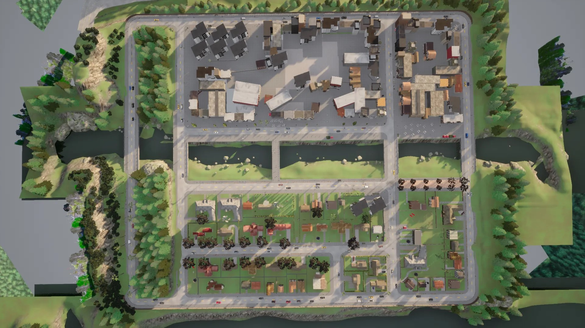
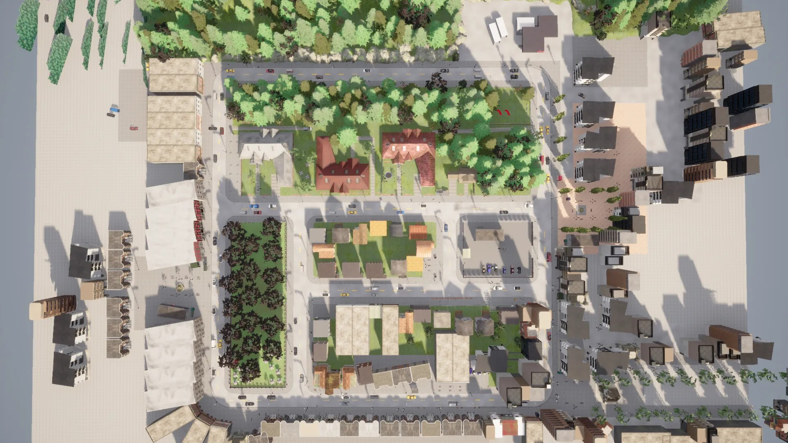
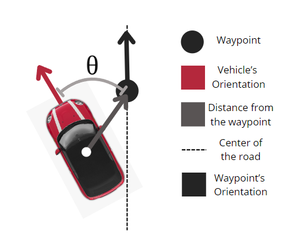
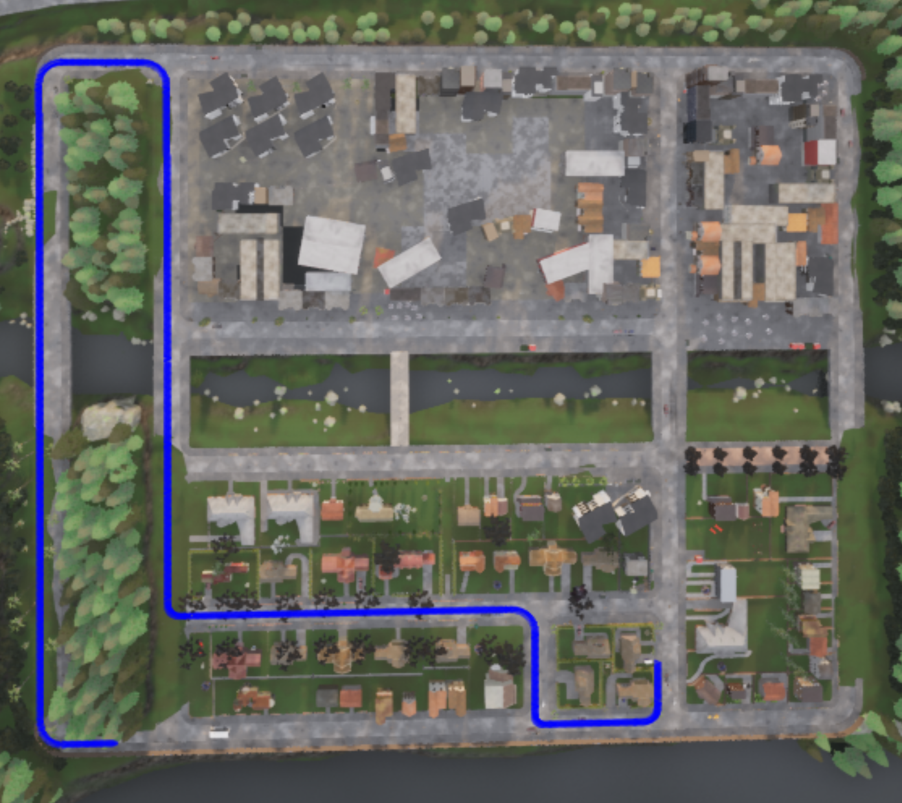

# Transfer-Reinforcement-Learning-for-Enhanced-Autonomy-in-Vehicles
Project of the course Project-Internship of Artificial Intelligence and Data Science (3rd year, 2nd semester)

## A little context
### Overview
This study investigates the application of reinforcement learning, specif-
ically the Proximal Policy Optimization (PPO) algorithm, in training au-
tonomous vehicles to navigate complex urban environments. Utilizing the
CARLA simulator, the research focuses on addressing the challenges posed
by unpredictable traffic patterns, diverse road conditions, and varying pedes-
trian behaviors. The project utilizes two urban settings, Town01 for initial
training and Town02 for transfer learning, to evaluate the generalization of
learned behaviors. Equipped with collision sensors and semantic segmented
cameras, the autonomous vehicle’s performance is assessed under varying
traffic densities. Key objectives include evaluating the efficacy of the PPO
algorithm in urban navigation and exploring the potential of transfer learn-
ing to generalize learned behaviors across different urban scenarios. Experi-
mental results are analyzed to highlight the strengths and limitations of the
approach, with a particular emphasis on the influence of traffic density on
performance. The findings underscore the importance of adaptability and
robustness in developing autonomous systems capable of handling real-world
urban driving challenges.

### The simulator
To achieve the objectives of this project, the CARLA simulator was selected
as the simulation environment. CARLA is an open-source simulator de-
signed specifically for autonomous driving research. It provides a highly
realistic urban environment that is ideal for training and evaluating au-
tonomous vehicle navigation systems.

### The urban environments
For the training and transfer learning processes, two urban environments
were considered in CARLA: Town01 and Town02. Town01 was used for the
initial training phase, while Town02 was employed to perform the transfer
learning of the trained model. This approach allows the model to contact
with different realities, therefore expanding its knowledge and capability of
generalization.
Town01 is a small town with numerous T-junctions and a variety of
buildings, surrounded by coniferous trees and featuring several small bridges
spanning across a river that divides the town into 2 halves.
Town02 is a small town with numerous T-junctions and a variety
of buildings, there are patches of coniferous trees, a park and a residential
and commercial area.

In Town02, to enhance the realism of the simulation, dynamic elements
such as pedestrians and other vehicles were incorporated. To assess the
influence of these variables, two training scenarios were conducted, the first
one without any vehicles or pedestrians, similar to Town01 and a second
where 30 vehicles and 10 pedestrians were included, 10% of the pedestrians
can cross the street, with the other 90% remaining on the sidewalks.
By utilizing Town01 for training and Town02 for transfer learning, and
incorporating autonomous pedestrians and vehicles, it was aimed to cre-
ate a comprehensive and challenging simulation environment, ensuring that
the autonomous vehicle is exposed to realistic and unpredictable scenarios,
which are crucial for developing robust navigation algorithms. This method-
ology was designed to rigorously test and refine the autonomous vehicle’s
ability to navigate safely and efficiently in diverse and dynamic urban land-
scapes.

#### Action Space
The action space in this autonomous vehicle navigation environment is rep-
resented as a continuous Box, which defines the permissible range of actions
the agent can take. It consists of three dimensions:
• Linear Velocity: Controls the forward speed of the vehicle, ranging
from 0.0 (no velocity) to 15.0 (maximum permissible velocity).
• Angular Velocity: Governs the rotational speed of the vehicle around
the vertical axis, with values ranging from -1.0 (counterclockwise ro-
tation) to 1.0 (clockwise rotation).
• Brake: Determines the intensity of braking applied to the vehicle,
ranging from 0.0 (no braking) to 1.0 (full braking).

#### Percepts (Observations)
The observation space is based on the sensory inputs to the autonomous
vehicle, enabling it to perceive and interact with its environment effectively.
It is also represented as a continuous Box, encompassing several dimensions:
• Camera Features: This dimension comprises 95 visual features ex-
tracted from the semantic segmented camera feed, providing detailed
environmental information.
• Distance: Represents the distance between the vehicle and specific
objects or reference points in the environment.
• Angle: Indicates the orientation angle of the vehicle relative to a
reference point, measured in radians.
• Length of the Route: Specifies the total planned length of the
vehicle’s route or trajectory.
• Collision Occurred: A binary flag (0 or 1) indicating whether a
collision has occurred (1 if yes, 0 if no).
• Lane Invasion Occured: A binary flag (0 or 1) indicating whether
a lane invasion has occurred (1 if yes, 0 if no).
The total size of the observation space is computed by summing the sizes
of all individual dimensions, resulting in a comprehensive vector that cap-
tures the environmental state perceived by the autonomous vehicle during
navigation.

#### Route Generation
The process of spawning the vehicle and generating its navigation route is
crucial for ensuring diverse training scenarios and avoiding overfitting to
specific conditions. The route planning is orchestrated using CARLA’s GlobalRoutePlanner
class, configured to generate paths with a high degree of randomness. The
objective is to maximize the route’s length while maintaining realism and
variability in the training data.
By integrating randomness into both the vehicle spawn location and the
route generation process, the simulation environment facilitates comprehen-
sive training scenarios that prepare the autonomous vehicle for real-world
challenges. This methodology mitigates the risk of overfitting to specific
conditions, thereby promoting the development of navigation policies that
generalize effectively across varied urban driving environments.

#### Sensors and Variational AutoEncoder
In autonomous driving systems, sensors are pivotal components that en-
able vehicles to perceive and interact with their environment. Three sen-
sors were utilized: the collision sensor, the Semantic Segmentation Camera
(SSC) which passes through a Variational Autoencoder (VAE), and the lane
invasion sensor.

The VAE is integrated to further enhance
the functionality of the SSC by extracting meaningful features from the
captured images. The VAE architecture compresses input images into a
latent space representation, preserving critical environmental details while
reducing the data’s dimensionality. This representation is essential for tasks
such as object recognition, path planning, and obstacle avoidance, providing
the vehicle with a robust understanding of its surroundings.
A pre-trained Variational Autoencoder (VAE) model was utilized ob-
tained from a [GitHub repository](https://github.com/idreesshaikh/Autonomous-Driving-in-Carla-using-Deep-Reinforcement-Learning/tree/main). The VAE model was originally trained
on 12,000 160x80 semantically segmented images collected during automatic
and manual driving sessions.

.png)

#### RL algorithm chosen
* PPO

#### Rewards
The reward function in the autonomous driving simulation system serves to
evaluate the agent’s actions and encourage behaviors that contribute to safe
and efficient navigation. It consists of several conditions that dynamically
adjust the reward based on the current state of the environment:
• Collision Penalty: If a collision occurs, a high penalty is applied,
and the episode is terminated. This ensures that the agent learns to
avoid collisions, which are critical for safe operation.
• Angle Penalty: If the angle between the vehicle’s direction and
the next waypoint exceeds a threshold, a penalty is applied. This
encourages the agent to follow smoother paths towards waypoints,
promoting more natural and efficient navigation.
• Lane Invasion Penalty: If a lane invasion has occurred, a penalty
is applied. This incentivizes the agent to stay in its road, providing a
more secure driving.
• Speed Penalties:
If the vehicle exceeds the maximum speed, a penalty is applied.
This discourages excessively fast driving.
If the vehicle is stationary, a penalty is applied. This discourages
idling and encourages continuous movement.
• Waypoint Reward: When the vehicle approaches a waypoint within
a defined threshold, a moderate reward is given. This encourages
progress towards waypoints and goal-oriented behavior.
• Destination Reward: Upon reaching the destination, a high reward
is given, and the episode is terminated. This incentivizes the agent to
successfully navigate to the intended destination.
• Neutral Reward: For states where none of the above conditions ap-
ply (else clause), a neutral reward is assigned. This maintains stability
in the reward system during non-critical states.
